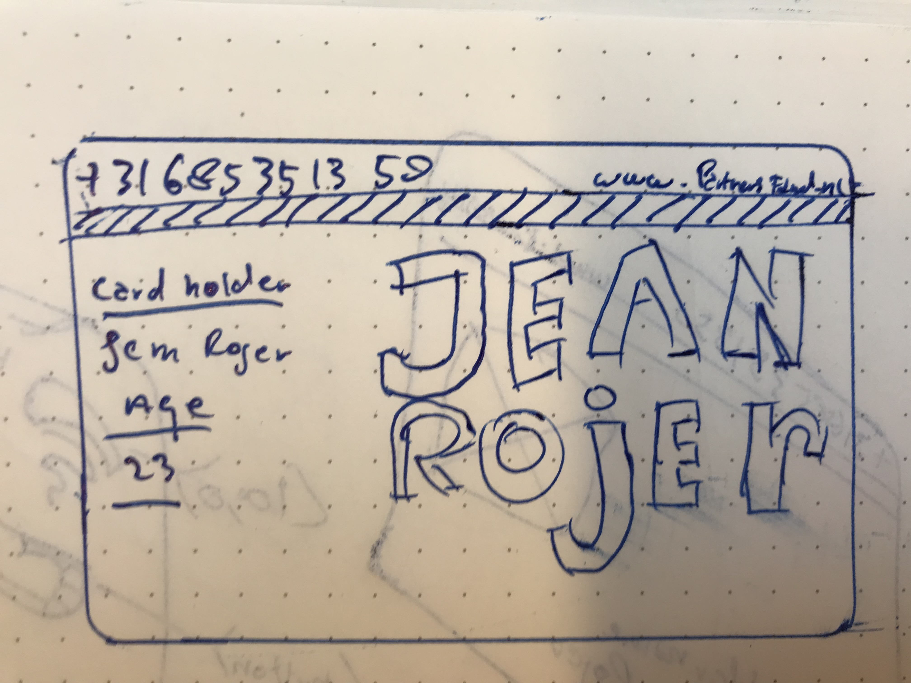

 
[](https://git.io/typing-svg)

https://user-images.githubusercontent.com/62628408/149836465-b3308125-6da8-40a8-91e6-a1a4afdcd517.gif
<svg xmlns="http://www.w3.org/2000/svg">
  <style>
    @import url(mystyles.css);
  </style>
  <rect .../>
</svg>

    ```
    
    test
    
    ```
# Analysis  
My goal is to redesign my business card based on an existing API.
I am expecting to be able to learn how to use JavaScript to 
get an API for this assigment. Furthermore I am expecting to 
use HTML,CSS and JavaScript for the redesign of my buisness card. 


 
# Design

<table>
  <tr>
    <td>Divergeren</td>
  
  </tr>
  <tr>
    <td valign="top"></td>
    <td valign="top"></td>
   <td valign="top"></td>
    <td valign="top"></td>
      <td valign="top"></td>  
 </table>
 
 <table>
  <tr> <td> Convergeren</td> 
  </tr>
  <tr>     <td valign="top"></td> 
  <td></img></td>
  <td valign="top"></td></tr>
  </table>
  
  # Build 
  
  # analyse

  # Integrate
  
  # Test 

[![JavaScript Style Guide][javascript-style-guide-badge]][standard]

   #Agenda 
   
|  date       |                              Description                                     |time         |             absent               |
| :---------: | :--------------------------------------------------------------------------: | :-----:     | :---------------------------------: |
|`07-02-2022` |      Briefing about the redesign of my buisnesscard                          | 09:30-13:00 | `Jean C.M Rojer;` |
 

It's an API used by FDND.

## License

[MIT](LICENSE) @ [FDND][fdnd]

<!-- Definitions -->

[fdnd]: https://fdnd.nl
[javascript-style-guide-badge]: https://img.shields.io/badge/code%20style-standard-brightgreen.svg
[standard]: https://standardjs.com/
